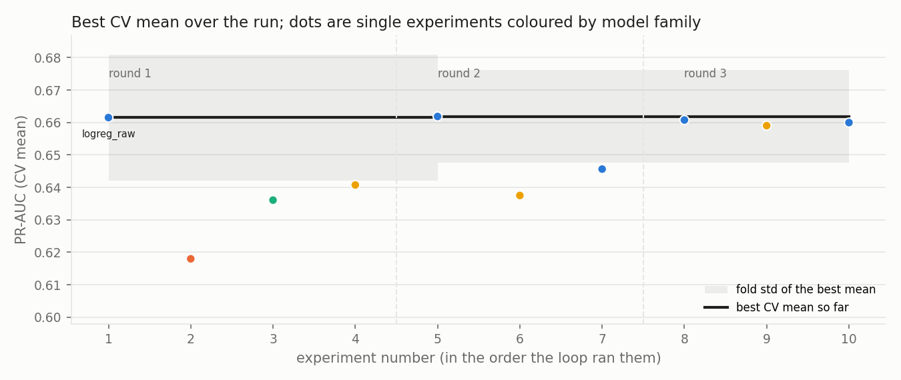

# auto-experimenter

[](https://github.com/aimanelasad/auto-experimenter/actions/workflows/tests.yml)

An autonomous experiment loop for churn models. A planner reads the ledger of everything tried so far and proposes the next experiments as testable hypotheses. The runner scores them under one fixed cross-validation protocol. A judge marks each hypothesis confirmed or refuted against the incumbent, fold by fold. A narrator turns the numbers into a short conclusion with next steps and retention actions.

- Live demo: https://auto-experimenter.streamlit.app (saved run shown instantly; a fresh loop runs in about 20 seconds)
- Dataset: [IBM Telco Customer Churn on Kaggle](https://www.kaggle.com/datasets/blastchar/telco-customer-churn), 7,043 customers, churn rate 26.5 %
- Two planners with the same interface: a deterministic rules planner (committed run below) and a Claude planner (`claude-opus-5`) whose proposals are validated by code before they run



## Results

Protocol: one stratified 80/20 holdout split (seed 42) made once and never used by the loop. Every experiment is scored by 5-fold stratified cross-validation on the train part with identical folds; preprocessing is fit inside each fold. The incumbent only changes on a confirmed verdict, and only the incumbent is refit and scored once on the holdout. Primary metric PR-AUC (average precision); a random ranking scores 0.265 (the churn rate).

Rules planner, 10 experiments in 3 rounds, 12 s on 2 CPU cores:

| experiment | model | features | CV PR-AUC (mean +- fold std) | CV ROC-AUC | lift@10% | verdict |
|---|---|---|---|---|---|---|
| random ranking (reference) | | | 0.265 | 0.500 | 1.00 | |
| `rf_raw` | random forest, defaults | raw | 0.618 +- 0.028 | 0.824 | 2.69 | no gain |
| `hgb_raw` | histogram gradient boosting, defaults | raw | 0.636 +- 0.020 | 0.831 | 2.71 | no gain |
| `lgbm_raw` | LightGBM, defaults | raw | 0.641 +- 0.017 | 0.834 | 2.79 | no gain |
| `lightgbm_raw_regularised` | LightGBM, 15 leaves, lr 0.03, 400 trees | raw | 0.659 +- 0.021 | 0.843 | 2.87 | no gain |
| `logreg_engineered` | logistic regression, C=1 | engineered | 0.662 +- 0.014 | 0.847 | 2.85 | inconclusive (+0.0003) |
| **`logreg_raw`** (winner, the baseline) | logistic regression, C=1 | raw | **0.662 +- 0.019** | 0.846 | 2.85 | baseline |

Winner on the holdout (scored once): PR-AUC 0.634, ROC-AUC 0.842, lift 2.81 in the top 10 % (precision 0.745 against a base rate of 0.265), Brier 0.138, ECE 0.025. The holdout PR-AUC sits 0.028 below the CV mean, inside two fold standard deviations.

The finding on this dataset: nothing beat the first logistic-regression baseline beyond fold noise, so the loop kept it. `logreg_engineered` has the highest CV mean, but the gain of 0.0003 has a paired t statistic near zero and stays inconclusive. Boosting at default settings overfits (0.618 to 0.641); regularising LightGBM closed most of the gap (0.641 to 0.659 on the same raw features) but not all of it. The loop stopped itself after round 3, once two consecutive rounds had passed without a confirmed gain. Published models on this table reach ROC-AUC around 0.84 to 0.85, which is where every linear variant here lands.

<!-- CLAUDE_RUN_START -->
### Rules planner versus Claude planner at equal budget

Not yet committed. `python -m autoexp run --planner claude --narrator claude --out results/claude` produces the Claude run with the same seed, folds, round limit and experiments per round; the comparison table goes here once it has been run.
<!-- CLAUDE_RUN_END -->

## The hypothesis trail

Every proposal is stored with its hypothesis and later its verdict, so refuted ideas stay visible. Rules run:

| round | experiment | hypothesis | PR-AUC | delta | verdict |
|---|---|---|---|---|---|
| 1 | `logreg_raw` | Linear baseline sets the floor; the main churn drivers are largely additive. | 0.6615 | | baseline |
| 1 | `rf_raw` | Bagged trees capture interactions without tuning; expected to beat the linear model on ROC-AUC. | 0.6180 | -0.0435 | no_gain |
| 1 | `hgb_raw` | Boosting usually wins on tabular data of this size. | 0.6361 | -0.0254 | no_gain |
| 1 | `lgbm_raw` | Leaf-wise boosting with the same defaults; does the implementation matter? | 0.6407 | -0.0208 | no_gain |
| 2 | `logreg_engineered` | Tenure buckets, add-on count and charge ratio encode known churn patterns explicitly. | 0.6618 | +0.0003 | inconclusive |
| 2 | `lightgbm_engineered` | Same features for the best boosting family. | 0.6375 | -0.0240 | no_gain |
| 2 | `logreg_minimal` | Do seven columns hold most of the signal? | 0.6456 | -0.0159 | no_gain |
| 3 | `logreg_raw_regularised` | Stronger L2 should reduce variance of the one-hot coefficients. | 0.6607 | -0.0008 | no_gain |
| 3 | `lightgbm_raw_regularised` | Fewer leaves, larger minimum leaves: was the gap to logreg overfitting rather than a family limit? | 0.6590 | -0.0025 | no_gain |
| 3 | `logreg_raw_balanced` | Balanced class weights rank rare churners higher, at some cost in calibration. | 0.6600 | -0.0015 | no_gain |

Verdicts compare the experiment with the incumbent on the same five folds: `confirmed` needs a mean gain of at least 0.002 PR-AUC and a paired t statistic of at least 2; `inconclusive` is a positive gain inside fold noise; `no_gain` is no improvement.

## What the narrator wrote

The narrator receives the leaderboard, the trail, the holdout metrics, the permutation drivers and the retention table as JSON and writes five fixed sections. The prompt is in [prompts/narrator.md](prompts/narrator.md) and works standalone on any metrics JSON of that shape; the template narrator in `autoexp/narrator.py` produces the same sections without a model. Full text of the saved run: [results/rules/narration.md](results/rules/narration.md).

Retention table from the same run (top decile of the holdout by predicted risk, 141 customers, observed churn rate 0.766):

| segment | customers | expected churners | observed churn rate | actions |
|---|---|---|---|---|
| Month-to-month / Fiber optic / tenure 0-6 months | 84 | 61 | 0.833 | 12-month contract with a price lock; onboarding check-in call; switch to automatic payment |
| Month-to-month / Fiber optic / tenure 7-12 months | 29 | 21 | 0.483 | 12-month contract with a price lock; automatic payment; bundle tech support or online security |
| Month-to-month / Fiber optic / tenure 13-24 months | 18 | 13 | 0.611 | same as above |
| all other segments (2 small groups) | 10 | 7 | 1.000 | 12-month contract with a first-year discount; onboarding check-in call; automatic payment |

## How to run

```bash
pip install -r requirements.txt
python -m autoexp run --planner rules --out results/rules            # about 15 s, no API key needed
python -m autoexp run --planner claude --narrator claude --out results/claude   # needs ANTHROPIC_API_KEY
python -m pytest -q                                                   # 11 tests, about 15 s
streamlit run app.py                                                  # the demo, loads results/ on start
```

The Claude planner and narrator read `ANTHROPIC_API_KEY` (and `ANTHROPIC_WORKSPACE_ID` for keys that are not scoped to a workspace) from the environment or from a `.env` file in the project root. Without a key everything falls back to the rules planner and the template narrator and says so. The demo runs on Streamlit Community Cloud straight from this repository (`packages.txt` pulls in the OpenMP runtime LightGBM needs); the `Dockerfile` serves the same app on port 7860 for any container host.

## Design decisions

- **Holdout touched once.** The loop only ever sees cross-validated numbers. The holdout score of the winner is reported next to the CV mean so the reader can see the gap; there is no second look and no re-selection on the holdout.
- **Identical folds, paired verdicts, one criterion.** All experiments share the same fold assignment, so two of them can be compared fold by fold. A gain must exceed the paired fold noise to count, the incumbent only moves on such a confirmed gain, and the stop rule counts the same verdicts. With about 1,100 validation rows per fold, PR-AUC differences below roughly 0.01 are usually noise, and the verdicts say so instead of celebrating a third decimal.
- **PR-AUC as the primary metric.** Churners are the class a retention team acts on, and the top of the ranking matters most; lift and precision in the top decile are reported as the business view of the same ranking.
- **No leakage.** One-hot encoding, scaling and feature engineering are steps of a scikit-learn pipeline fit inside every fold. The 11 customers with tenure 0 have blank total charges in the source file; they become 0, and the derived ratios fall back to the monthly charge for them. Calibration experiments use `CalibratedClassifierCV(ensemble=False)` so that the calibrated model is the incumbent plus a monotone mapping rather than a bagged ensemble.
- **The model proposes, the code validates.** Claude returns a structured object (pydantic schema via the Messages API structured-output mode). Every proposal then passes the same range checks as the rules planner, duplicates of earlier experiments are dropped by a hash of the configuration, and any failure (invalid or truncated output, refusal, network error, daily cap) falls back to the rules planner for that round and is recorded in the run log. A planner that asks to stop is obeyed.
- **Stopping rule.** The loop stops when the planner says so or after two consecutive rounds without a confirmed gain, whichever comes first.
- **Cost guard for the public demo.** The hosted app holds the owner's key: one Claude run per browser session, a soft daily cap on model calls, medium effort for planning calls, and the deterministic path as the default. A full Claude run costs roughly 5 to 15 US cents.
- **Boosting is not cut from the search space although it loses here.** Keeping it in and letting the loop refute it is the point: the trail shows why the simpler model was kept.

## Limitations and what I would do next

- One dataset, 7,043 rows, one holdout split. Differences between model families are around 0.01 PR-AUC and mostly noise; the loop's value on this table is in ruling options out quickly, not in finding a much better model.
- Permutation importance on a linear model with correlated inputs (tenure, monthly and total charges) splits credit between them; a SHAP view would be cleaner.
- Next: repeat the loop over several holdout seeds to put an interval on the CV-holdout gap; add pairwise interaction terms for the linear model; give the planner the remaining compute budget so it can trade breadth against depth; run the two planners over five seeds to make the head-to-head a distribution rather than a single number.

## Repository layout

```
autoexp/           the package: data, features, models, metrics, spec, experiments (runner and ledger),
                   planner (rules), planner_claude, llm, loop, retention, narrator, report, figures, __main__
prompts/           planner.md and narrator.md (the narrator prompt is the standalone challenge-3 artifact)
results/rules/     saved run: ledger.jsonl, leaderboard.csv, trail.csv, run.json, final.json, narration.md, figures/
app.py             Streamlit demo
tests/             pytest suite (data, features, metrics, spec validation, judge, runner, planner, save/load)
scripts/           screenshots.py, build_submission.py
data/              committed copy of the Telco CSV (IBM sample data)
```

## Dataset

IBM Telco Customer Churn, as published on [Kaggle](https://www.kaggle.com/datasets/blastchar/telco-customer-churn) and in IBM's sample data. The CSV is committed under `data/` so the demo works without a download. Code is under the MIT license.
